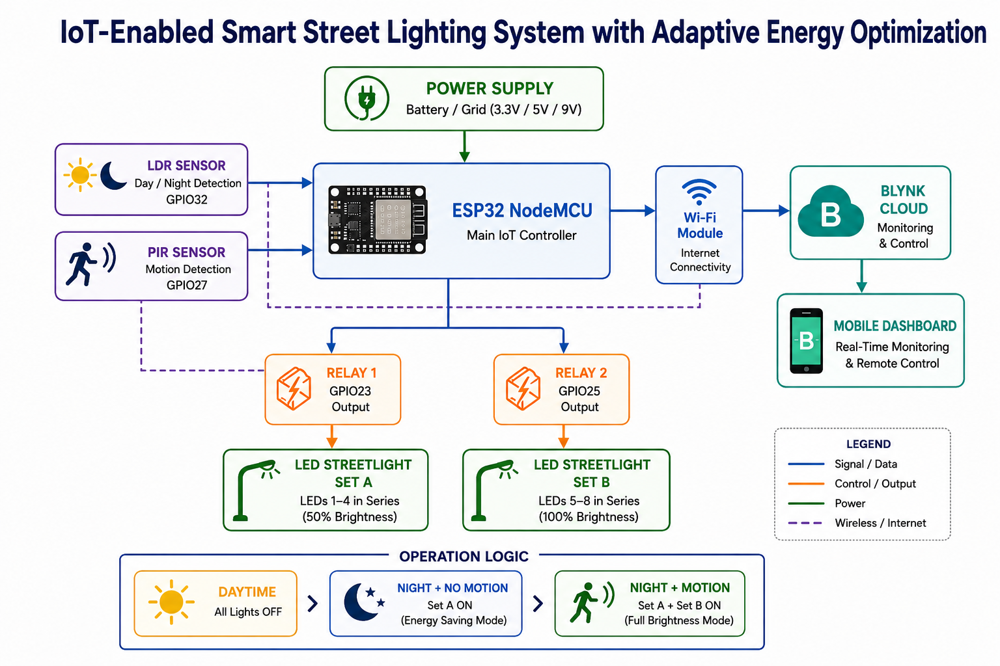
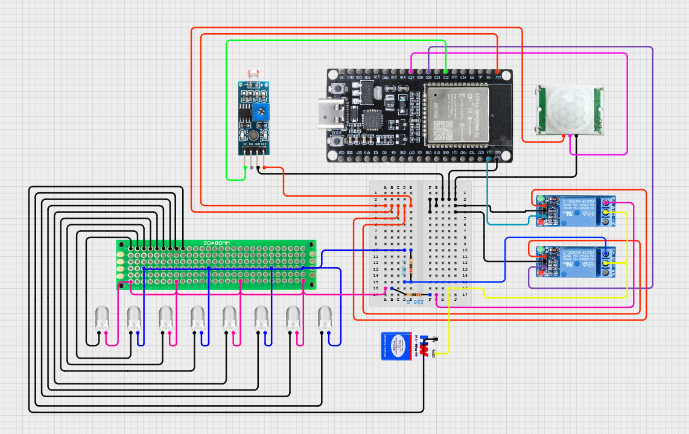
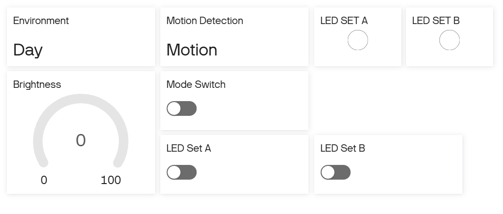

# 🌙 IoT-Enabled Smart Street Lighting System
### Adaptive Energy Optimization with ESP32 + Blynk

---

## 🖼️ Project Images

### Block Diagram


### Circuit Diagram


### Blynk Dashboard


---

## 📌 Overview

A smart street lighting system that automatically controls LED street lights based on ambient light and motion detection. The system optimizes energy consumption by running lights at full brightness only when needed, and allows remote monitoring and manual control via the Blynk IoT app.

---

## ✨ Features

- **Automatic Mode** — Fully sensor-driven day/night and motion detection logic
- **Manual Mode** — Independent control of each LED set via Blynk app
- **Energy Optimization** — 0% power during day, 50% at night with no motion, 100% when motion detected
- **Real-time Monitoring** — Live sensor readings and system state on Blynk dashboard
- **Motion Hold Timer** — Lights stay fully ON for 1 second after motion stops before dimming
- **WiFi Connectivity** — ESP32 connects to Blynk Cloud via WiFi

---

## 🛠️ Components Used

| Component | Quantity | Purpose |
|---|---|---|
| ESP32 NodeMCU (ESP-32S) | 1 | Main controller |
| LDR Sensor Module | 1 | Ambient light detection (day/night) |
| PIR Motion Sensor | 1 | Human motion detection |
| SRD-05VDC-SL-C Relay Module | 2 | Switching LED sets |
| LEDs | 8 | Street light simulation (2 sets of 4) |
| Current limiting resistors | 2 | One per LED set |
| Jumper wires | — | Connections |
| Power supply (3.3V / 5V) | — | Powers components |

---

## 🔌 Pin Connections

### LDR Sensor
| LDR Pin | ESP32 Pin |
|---|---|
| VCC | 3.3V |
| GND | GND |
| AO (Analog Out) | GPIO32 |

### PIR Motion Sensor
| PIR Pin | ESP32 Pin |
|---|---|
| VCC | VIN (5V) |
| GND | GND |
| OUT | GPIO27 |

### Relay 1 — Controls LED Set A (LEDs 1–4)
| Relay Pin | Connects To |
|---|---|
| VCC | ESP32 3.3V |
| GND | ESP32 GND |
| IN | ESP32 GPIO23 |
| COM | Power supply (+) |
| NO | LED Set A anode (through resistor) |

### Relay 2 — Controls LED Set B (LEDs 5–8)
| Relay Pin | Connects To |
|---|---|
| VCC | ESP32 3.3V |
| GND | ESP32 GND |
| IN | ESP32 GPIO25 |
| COM | Power supply (+) |
| NO | LED Set B anode (through resistor) |

> ⚠️ **Important:** Connect ESP32 GND and power supply GND together (common ground).

### LED Sets (series connection)
- **Set A:** LED1 → LED2 → LED3 → LED4 → GND
- **Set B:** LED5 → LED6 → LED7 → LED8 → GND

---

## ⚙️ System Working

### Three Operating States (Automatic Mode)

| State | Condition | Relay 1 (Set A) | Relay 2 (Set B) | Brightness |
|---|---|---|---|---|
| Day mode | LDR ≤ 2800 | OFF | OFF | 0% |
| Night, no motion | LDR > 2800, PIR LOW | ON | OFF | 50% |
| Night, motion detected | LDR > 2800, PIR HIGH | ON | ON | 100% |

### Mode Selection (via Blynk V5 switch)

**Automatic Mode (V5 = 0)**
- System is fully sensor-driven
- LDR decides day/night, PIR decides full/dim lighting
- 1-second hold timer keeps full brightness after motion stops

**Manual Mode (V5 = 1)**
- Sensor readings are still displayed on app but do not control relays
- V6 switch independently controls LED Set A
- V7 switch independently controls LED Set B

---

## 📱 Blynk Configuration

### Datastreams

| Virtual Pin | Name | Data Type | Min | Max | Purpose |
|---|---|---|---|---|---|
| V0 | Environment Status | String | — | — | Shows "Day" or "Night" |
| V1 | Motion Status | String | — | — | Shows "Motion" or "No Motion" |
| V2 | Brightness | Integer | 0 | 100 | Current brightness % |
| V3 | LED SET A | Integer | 0 | 1 | LED Set A state |
| V4 | LED SET B | Integer | 0 | 1 | LED Set B state |
| V5 | Mode Switch | Integer | 0 | 1 | 0 = Auto, 1 = Manual |
| V6 | Manual LED A | Integer | 0 | 1 | Manual control — Set A |
| V7 | Manual LED B | Integer | 0 | 1 | Manual control — Set B |

### Dashboard Widgets
- V0, V1 → Label / Value Display
- V2 → Gauge (0–100)
- V3, V4 → LED indicator widget
- V5, V6, V7 → Switch widgets

---

## 🚀 Getting Started

### 1. Install Libraries (Arduino IDE)
- **Blynk** by Volodymyr Shymanskyy (via Library Manager)
- **WiFi** (built into ESP32 board package)

### 2. Install ESP32 Board
In Arduino IDE → Preferences → Add this URL to board manager:
```
https://raw.githubusercontent.com/espressif/arduino-esp32/gh-pages/package_esp32_index.json
```
Then install **esp32 by Espressif Systems** via Board Manager.

### 3. Configure the Code
Open `smart_street_light_blynk.ino` and update:
```cpp
#define BLYNK_TEMPLATE_ID   "Your_Template_ID"
#define BLYNK_TEMPLATE_NAME "Your_Template_Name"
#define BLYNK_AUTH_TOKEN    "Your_Auth_Token"

char ssid[] = "Your_WiFi_Name";
char pass[] = "Your_WiFi_Password";
```

### 4. Upload
- Select board: **ESP32 Dev Module**
- Select correct COM port
- Click **Upload**

### 5. Monitor
Open Serial Monitor at **115200 baud** to see live sensor readings and system state.

---

## 📊 Energy Optimization

| Time | Condition | Power Usage |
|---|---|---|
| Daytime | LDR detects sunlight | 0% — all lights OFF |
| Night, idle | No motion detected | 50% — 4 LEDs only |
| Night, active | Motion detected | 100% — all 8 LEDs ON |

The core principle: **lights are as bright as they need to be, and no brighter.**

---

## 🔧 Key Configuration Values

```cpp
#define LDR_THRESHOLD   2800    // Above = Night (based on actual sensor readings)
#define HOLD_TIME       1000    // ms to stay at full brightness after motion stops
#define RELAY_ON        HIGH    // Active HIGH relay module
#define RELAY_OFF       LOW
```

---

## 👤 Author

**Shiyam**
- GitHub: [@Shiyam-27](https://github.com/Shiyam-27)

---

## 📄 License

This project is open source and available under the [MIT License](LICENSE).
